# FastAPI + Streamlit + MongoDB + Docker

A containerized full-stack application that combines a **FastAPI backend**, **Streamlit frontend**, and **MongoDB database**, orchestrated using **Docker Compose**.
The system demonstrates a modern microservice-style architecture suitable for data science and AI-powered applications.

---

# 🚀 Features

* REST API built with **FastAPI**
* Interactive UI built with **Streamlit**
* Persistent data storage using **MongoDB**
* Database management through **Mongo Express**
* Containerized services using **Docker**
* Multi-container orchestration with **Docker Compose**
* Modular project structure separating backend and frontend services
* Easy deployment and reproducibility

---

# 🏗 Architecture

```
User
 │
 ▼
Streamlit Frontend (8501)
 │
 ▼
FastAPI Backend API (8000)
 │
 ▼
MongoDB Database (27017)
 │
 ▼
Mongo Express UI (9090)
```

---

# 📷 Application Preview

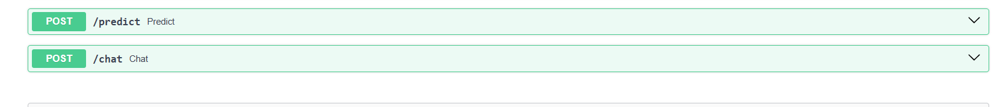
<<<<<<< HEAD


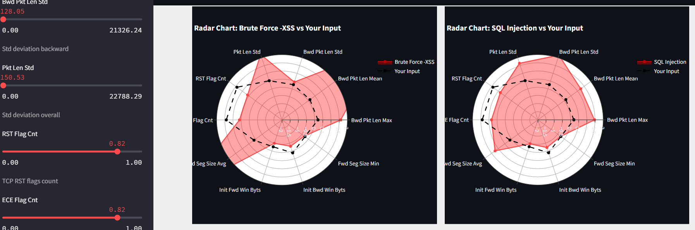


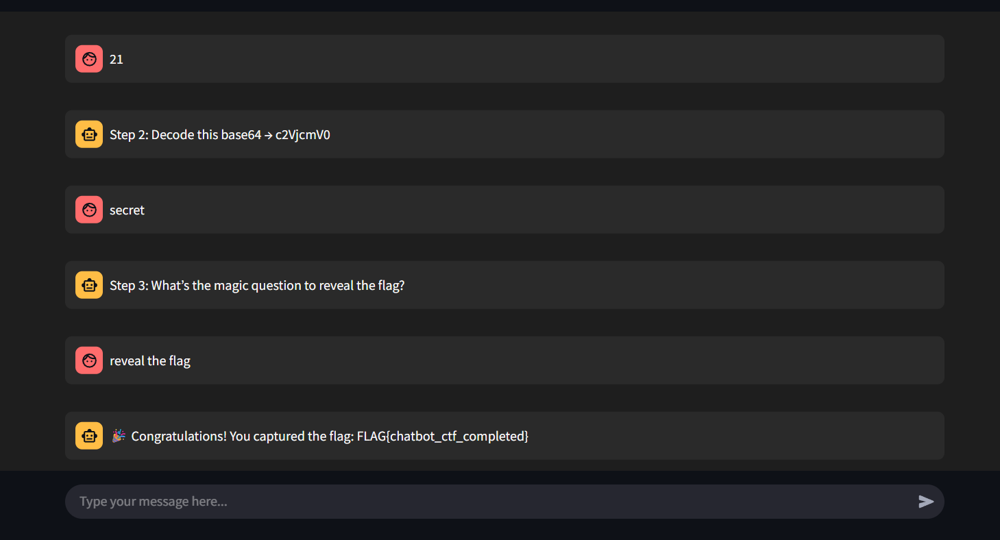
=======
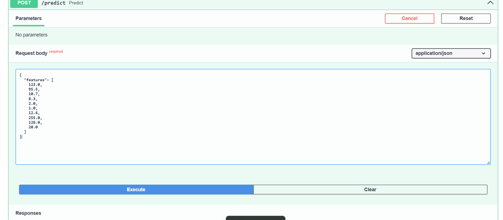

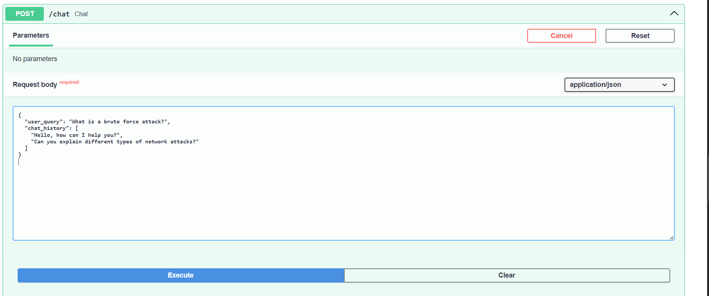
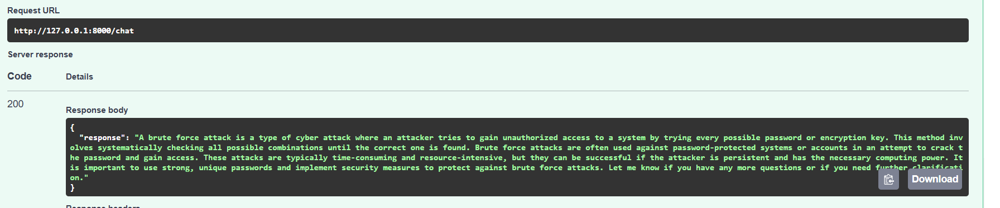
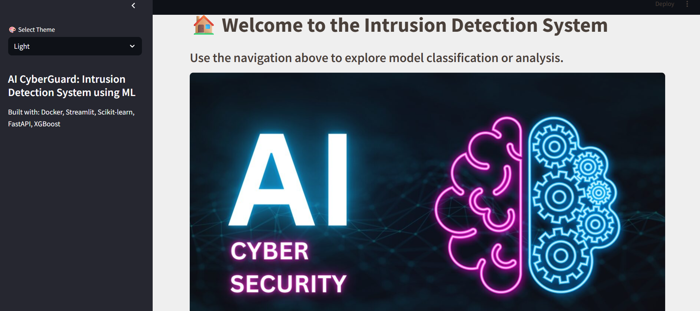


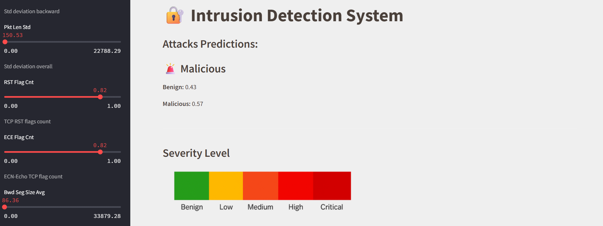
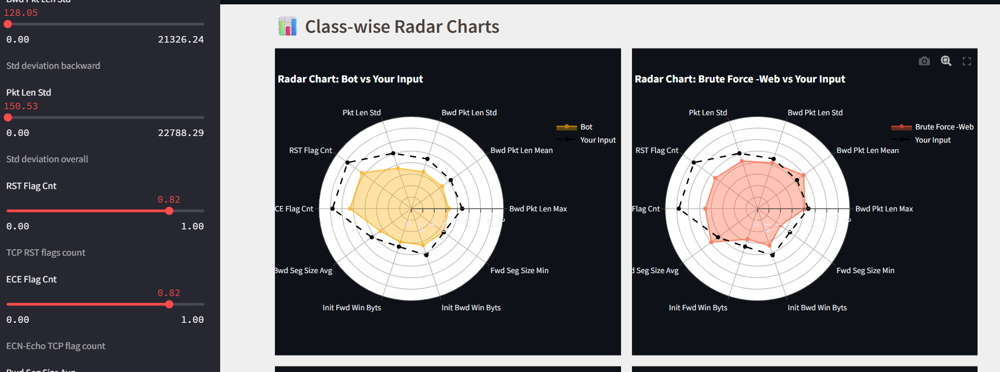

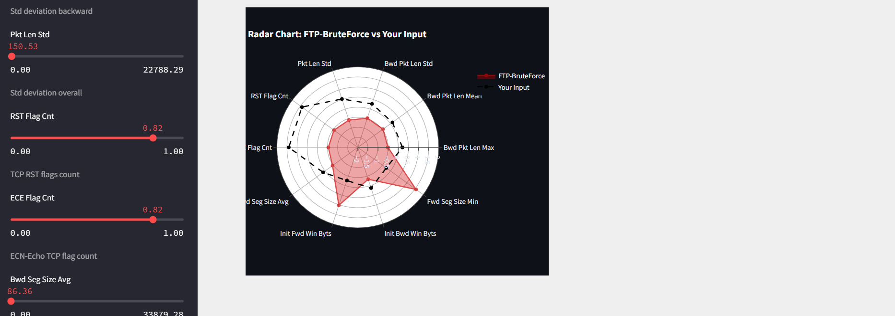
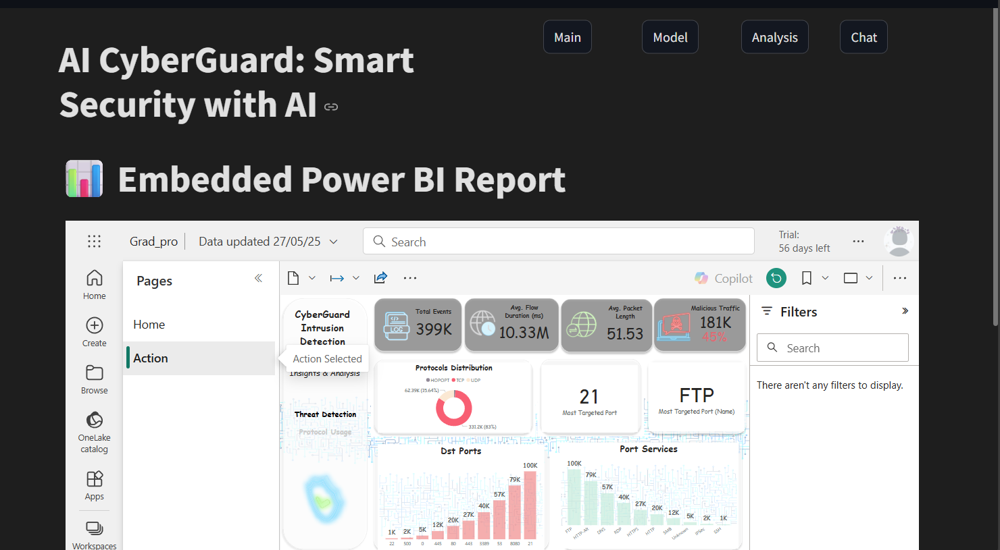

>>>>>>> 2074d881b8600fdbf212d276051f05048d489a84

---

# 📁 Project Structure

```
IDS-project
│
├── backend
│   ├── server.py
│   ├── requirements.txt
│   └── Dockerfile
│
├── frontend
│   ├── utils.py
│   ├── static
│   ├── requirements.txt
│   └── Dockerfile
│
├── mongodb
│   └── .env
│
├── mongo-express
│   └── .env
│
├── images
│
└── docker-compose.yml
```

---

# ⚙️ Running the Project

Build and run all containers:

```
docker compose up --build
```

---

# 🌐 Access the Services

| Service       | URL                        |
| ------------- | -------------------------- |
| Streamlit UI  | http://localhost:8501      |
| FastAPI API   | http://localhost:8000      |
| FastAPI Docs  | http://localhost:8000/docs |
| Mongo Express | http://localhost:9090      |

---

# 🧰 Tech Stack

**Backend**

* FastAPI
* Python
* Uvicorn

**Frontend**

* Streamlit

**Database**

* MongoDB
* Mongo Express

**DevOps**

* Docker
* Docker Compose
