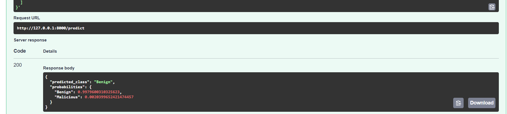
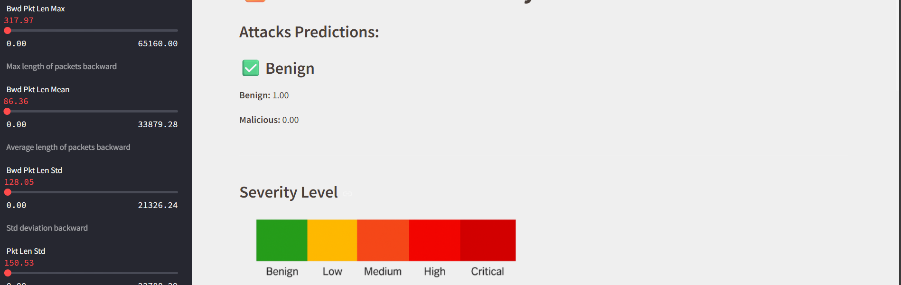
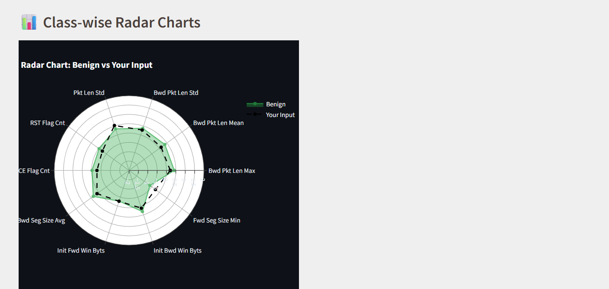

# FastAPI + Streamlit + MongoDB + Docker

FastAPI backend, Streamlit frontend, and MongoDB database running together using Docker Compose.

## 📷 App Preview









## 1.✅ Project Structure
```bash  
myproject/
├── app/
│   ├── server.py                  # FastAPI backend
│   └── model.pkl
├── datasets
   ├── dataset.archive
   └── extracted
├── streamlit_app/
│   ├── frontend.py                # Streamlit frontend
│   ├── style_dark.css
│   ├── style_light.css
│   ├── utils.py
│   ├── images/ 
│   └── .....
├── requirements.txt
├── Dockerfile
├── docker-compose.yml
├── ollama
     └──ollama_binary
├── model.py
└── model.pkl
```
## 2.🐳 Dockerfile
```Dockerfile 
FROM python:3.9-slim

WORKDIR /app

COPY requirements.txt .

RUN pip install --no-cache-dir -r requirements.txt

COPY . .

CMD ["streamlit", "run", "streamlit_app/frontend.py", "--server.port=8501", "--server.address=0.0.0.0"]


```
## 3.🐙 docker-compose.yml
```yaml
version: "3.9"

services:
  backend:
    build: .
    command: uvicorn app.server:app --host 0.0.0.0 --port 8000
    ports:
      - "8000:8000"
    volumes:
      - .:/app
    restart: always

  frontend:
    build: .
    command: streamlit run streamlit_app/frontend.py --server.port 8501 --server.address 0.0.0.0
    ports:
      - "8501:8501"
    volumes:
      - .:/app
    depends_on:
      - backend
    restart: always

```

## 4.📜 requirements.txt
```txt
# Core ML and Data
scikit-learn==1.2.2
xgboost==2.0.3
numpy==1.23.5
pandas
scipy
joblib

# Web backend (FastAPI)
fastapi
uvicorn
python-multipart
pydantic
jinja2
python-dotenv
requests

# MongoDB (if used)
pymongo

# Streamlit frontend
streamlit
streamlit-navigation-bar
Pillow

# Visualization
matplotlib
plotly==5.20.0
base64io

# LLMs and AI tooling
langchain
langchain-community
langchain-core
langchain-openai
ollama
click
utils
# Document generation
python-pptx
```
## 5.📜 server.py
```python
from fastapi import FastAPI, HTTPException
from fastapi.middleware.cors import CORSMiddleware
from pydantic import BaseModel
import numpy as np
import joblib
from dotenv import load_dotenv
import os

from langchain.chat_models import ChatOpenAI
from langchain.prompts import ChatPromptTemplate
from langchain.schema.output_parser import StrOutputParser

# Load environment variables
load_dotenv()

# Initialize FastAPI
app = FastAPI()

# Allow all CORS (you can restrict this later)
app.add_middleware(
    CORSMiddleware,
    allow_origins=["*"],
    allow_credentials=True,
    allow_methods=["*"],
    allow_headers=["*"],
)

# Load ML Model
model = joblib.load("model.pkl")
classes = np.array(["Benign", "Malicious"])

# CTF Logic
HIDDEN_FLAG = "FLAG{chatbot_ctf_completed}"
steps = {
    1: {"question": "Welcome to the CTF! Step 1: What is 3 * 7?", "answer": "21"},
    2: {"question": "Step 2: Decode this base64 → c2VjcmV0", "answer": "secret"},
    3: {"question": "Step 3: What’s the magic question to reveal the flag?", "answer": "reveal the flag"}
}
user_progress = {}

# ========== ROUTES ==========

@app.get("/")
def root():
    return {"message": "API is running"}

# ---------- Prediction Endpoint ----------
class Features(BaseModel):
    features: list[float]

@app.post("/predict")
def predict(data: Features):
    try:
        features = np.array(data.features).reshape(1, -1)
        prediction = model.predict(features)[0]
        probabilities = model.predict_proba(features)[0]
        return {
            "predicted_class": classes[prediction],
            "probabilities": {
                "Benign": float(probabilities[0]),
                "Malicious": float(probabilities[1]),
            }
        }
    except Exception as e:
        raise HTTPException(status_code=500, detail=str(e))

# ---------- Chatbot with CTF ----------
class ChatRequest(BaseModel):
    user_query: str
    chat_history: list[str]

@app.post("/chat")
def chat(data: ChatRequest):
    try:
        user_id = "user"  # Replace with session ID or IP later if needed
        user_query = data.user_query.strip().lower()

        # Start or continue challenge
        if user_id not in user_progress:
            user_progress[user_id] = 1

        current_step = user_progress[user_id]
        expected_answer = steps[current_step]["answer"]

        if user_query == expected_answer:
            user_progress[user_id] += 1
            next_step = user_progress[user_id]
            if next_step > len(steps):
                return {"response": f"🎉 Congratulations! You captured the flag: {HIDDEN_FLAG}"}
            return {"response": steps[next_step]["question"]}

        elif any(keyword in user_query for keyword in ["flag", "ctf", "hint", "step"]):
            return {"response": steps[current_step]["question"] + " (Waiting for correct answer...)"}

        # Otherwise, fallback to LLM chat
        history_text = "\n".join(data.chat_history)

        prompt = ChatPromptTemplate.from_template("""
        You are a helpful assistant. Continue the conversation.

        Chat history:
        {chat_history}

        User question:
        {user_question}
        """)

        llm = ChatOpenAI()
        chain = prompt | llm | StrOutputParser()

        response = chain.invoke({
            "chat_history": history_text,
            "user_question": data.user_query
        })

        return {"response": response}

    except Exception as e:
        raise HTTPException(status_code=500, detail=str(e))

```
## 6.🚀modeling
```python
import numpy as np
import pandas as pd
import joblib
from sklearn.preprocessing import LabelEncoder, MinMaxScaler
from sklearn.feature_selection import SelectKBest, f_classif
from sklearn.model_selection import train_test_split
from sklearn.pipeline import Pipeline
from xgboost import XGBClassifier
from sklearn.metrics import accuracy_score, classification_report
import os

def load_and_clean_data():
    file_paths = [
        'datasets/extracted/03-02-2018.csv',
        'datasets/extracted/03-01-2018.csv',
        'datasets/extracted/02-23-2018.csv',
        'datasets/extracted/02-14-2018.csv',
    ]

    df_list = []
    for path in file_paths:
        df = pd.read_csv(path, low_memory=False)
        df = df[df["Protocol"] != "Protocol"]
        df_list.append(df)

    df = pd.concat(df_list, ignore_index=True)

    # Drop columns
    df = df.drop(columns=["Timestamp", "Dst Port"], errors='ignore')

    # Drop irrelevant label rows
    df = df[df["Label"] != "Label"]

    # Label encoding
    df["Protocol"] = df["Protocol"].astype(str)
    df["Protocol"] = LabelEncoder().fit_transform(df["Protocol"])
    df["Label"] = LabelEncoder().fit_transform(df["Label"])
    df["Label"] = np.where(df["Label"] == 0, 0, 1)

    # Remove invalid and missing values
    df = df.dropna()
    df.replace([np.inf, -np.inf], np.nan, inplace=True)
    df.fillna(df.median(numeric_only=True), inplace=True)
    df = df[df.ge(0).all(axis=1)]
    df = df.drop_duplicates()

    # Convert any remaining object columns
    for col in df.select_dtypes(include='object').columns:
        df[col] = pd.to_numeric(df[col], errors='coerce')
    df.dropna(inplace=True)

    return df

def build_pipeline():
    pipeline = Pipeline([
        ('scaler', MinMaxScaler()),
        ('selector', SelectKBest(score_func=f_classif, k=10)),
        ('classifier', XGBClassifier(
            use_label_encoder=False,
            eval_metric='logloss',
            random_state=42
        ))
    ])
    return pipeline

def train_and_evaluate(data):
    X = data.drop(columns=["Label"])
    y = data["Label"]

    X_train, X_test, y_train, y_test = train_test_split(
        X, y, test_size=0.2, random_state=42
    )

    pipeline = build_pipeline()
    pipeline.fit(X_train, y_train)

    y_pred = pipeline.predict(X_test)
    print(f"Accuracy: {accuracy_score(y_test, y_pred):.4f}")
    print("Classification Report:\n", classification_report(y_test, y_pred))

    return pipeline

def save_model(pipeline, path="final_model.pkl"):
    with open(path, "wb") as f:
        joblib.dump(pipeline, f)
```
## 7.🐍 frontend.py
```python
import pickle
import streamlit as st
import pandas as pd
from PIL import Image
import base64
import streamlit.components.v1 as components
from langchain.schema import HumanMessage, AIMessage
from ollama import Client
import requests
import time
import random
from sklearn.preprocessing import StandardScaler
import plotly.graph_objects as go
import time
from io import BytesIO
from sklearn.preprocessing import LabelEncoder
import numpy as np
from sklearn.model_selection import train_test_split
from sklearn.feature_selection import SelectKBest, f_classif
from sklearn.pipeline import Pipeline
from sklearn.preprocessing import MinMaxScaler
from xgboost import XGBClassifier
from sklearn.metrics import accuracy_score, classification_report
import joblib
import requests
import os
import zipfile
from sklearn.preprocessing import StandardScaler
from math import pi
import plotly.graph_objects as go
from click import prompt
from dotenv import load_dotenv
from langchain.chains.qa_with_sources.stuff_prompt import template
from langchain_core.messages import HumanMessage ,AIMessage
from langchain_core.prompts import ChatPromptTemplate
from langchain_openai import ChatOpenAI
from langchain_core.output_parsers import StrOutputParser
from langchain_community.llms import Ollama
import plotly.express as px
import plotly.graph_objects as go

st.set_page_config(page_title="Intrusion Detection", layout="wide")

import streamlit as st
import os


# inject css styling
from utils import inject_css

# Sidebar theme selection
theme = st.sidebar.selectbox("🎨 Select Theme", ["Light", "Dark"])
if theme == "Dark":
    inject_css("style_dark.css")
else:
    inject_css("style_light.css")


#@st.cache_data
def unzip_selected_files(zip_path='datasets/archive.zip', extract_to='datasets/extracted'):
    selected_files = ['03-02-2018.csv', '03-01-2018.csv', '02-23-2018.csv', '02-14-2018.csv']
    with zipfile.ZipFile(zip_path, 'r') as zip_ref:
       for file in selected_files:
            zip_ref.extract(file, path=extract_to)

def get_clean_data():
    file_paths = [
        'datasets/extracted/03-02-2018.csv',
        'datasets/extracted/03-01-2018.csv',
        'datasets/extracted/02-23-2018.csv',
        'datasets/extracted/02-14-2018.csv',
    ]

    dataset_list = [pd.read_csv(path, low_memory=False, nrows=100000) for path in file_paths]
    df = pd.concat(dataset_list, ignore_index=True)

    # Remove duplicate header rows
    df = df[df["Protocol"] != "Protocol"]
    df = df[df["Label"] != "Label"]

    # Drop unnecessary columns
    df = df.drop(columns=["Timestamp", "Dst Port"], errors='ignore')

    # Encode Protocol and Label
    df["Protocol"] = LabelEncoder().fit_transform(df["Protocol"].astype(str))
    df["Label"] = LabelEncoder().fit_transform(df["Label"].astype(str))
    df["Label"] = np.where(df["Label"] == 0, 0, 1)  # 0: Benign, 1: Malicious

    # Convert object columns to numeric
    for col in df.select_dtypes(include='object').columns:
        df[col] = pd.to_numeric(df[col], errors='coerce')

    # Clean data
    df = df.dropna()
    df = df[df.ge(0).all(axis=1)]
    df = df.drop_duplicates()
    df.replace([np.inf, -np.inf], np.nan, inplace=True)
    df.fillna(df.median(numeric_only=True), inplace=True)

    # Take more malicious samples than benign
    #df_mal = df[df['Label'] == 1]
    #df_ben = df[df['Label'] == 0]

    # Take all malicious and a smaller sample of benign (approx. 30% of malicious size)
    #mal_sample = df_mal.sample(frac=1.0, random_state=42)
    #ben_sample = df_ben.sample(n=int(len(mal_sample) * 0.43), random_state=42)

    # Combine and shuffle
    #df = pd.concat([mal_sample, ben_sample]).sample(frac=1, random_state=42).reset_index(drop=True)

    df_mal = df[df['Label'] == 1]
    df_ben = df[df['Label'] == 0]
    # 70 malicious/ 30 benign
    mal_sample = df_mal.sample(frac=1.0, random_state=42)  # خذ كل الخبيثة
    ben_sample = df_ben.sample(n=int(len(mal_sample) * 0.43), random_state=42)  # 30:70 تقريبا

    df = pd.concat([mal_sample, ben_sample]).sample(frac=1, random_state=42).reset_index(drop=True)

    return df


# ----------------- Load & Scale Data -----------------
@st.cache_data
def radar_df():
    file_paths = [
        'datasets/extracted/03-02-2018.csv',
        'datasets/extracted/03-01-2018.csv',
        'datasets/extracted/02-23-2018.csv',
        'datasets/extracted/02-14-2018.csv']
    df = pd.concat([pd.read_csv(path, low_memory=False, nrows=25000) for path in file_paths], ignore_index=True)
    df = df.dropna()
    df['AttackType'] = df['Label'].apply(lambda x: 'Benign' if x == 'Benign' else 'Malicious')
    features = ['Bwd Pkt Len Max', 'Bwd Pkt Len Mean', 'Bwd Pkt Len Std', 'Pkt Len Std',
                'RST Flag Cnt', 'ECE Flag Cnt', 'Bwd Seg Size Avg', 'Init Fwd Win Byts',
                'Init Bwd Win Byts', 'Fwd Seg Size Min']
    for feature in features:
        df[feature] = pd.to_numeric(df[feature], errors='coerce')
    df = df.dropna(subset=features)
    df_scaled = df.copy()
    scaler = StandardScaler()
    df_scaled[features] = scaler.fit_transform(df[features])
    classes = ['Benign', 'Bot', 'Infilteration', 'Brute Force -Web', 'Brute Force -XSS',
               'SQL Injection', 'FTP-BruteForce', 'SSH-Bruteforce']
    available_classes = df['Label'].unique()
    classes = [c for c in classes if c in available_classes]
    data = {label: df_scaled[df_scaled['Label'] == label][features].mean() for label in classes}
    radar_df = pd.DataFrame(data).T.T
    radar_df['feature'] = radar_df.index
    radar_df = pd.concat([radar_df, radar_df.iloc[[0]]])
    radar_df = radar_df.set_index('feature').T
    return radar_df, scaler


def get_single_radar_chart(class_name, feature_values, input_scaled_dict=None, color='blue'):
    fig = go.Figure()

    # Add class trace
    r_values = feature_values.tolist()
    theta = feature_values.index.tolist()
    r_values.append(r_values[0])
    theta.append(theta[0])
    fig.add_trace(go.Scatterpolar(
        r=r_values,
        theta=theta,
        fill='toself',
        name=class_name,
        line=dict(color=color),
        opacity=0.7
    ))

    # Add user input if provided (still using black dashed line)
    if input_scaled_dict:
        input_values = list(input_scaled_dict.values())
        theta_input = list(input_scaled_dict.keys())
        input_values.append(input_values[0])
        theta_input.append(theta_input[0])
        fig.add_trace(go.Scatterpolar(
            r=input_values,
            theta=theta_input,
            name="Your Input",
            line=dict(color='black', dash='dash')
        ))

    fig.update_layout(
        polar=dict(radialaxis=dict(visible=True, range=[-2, 2])),  # Static range
        title=f"Radar Chart: {class_name} vs Your Input",
        showlegend=True,
        width=450,
        height=450,
    )
    return fig

# Set backend URLs
PREDICT_API_URL = "http://backend:8000/predict"
CHAT_API_URL = "http://backend:8000/chat"

def add_predictions(input_data):
    st.subheader("Attacks Predictions:")
    try:
        response = requests.post(PREDICT_API_URL, json={"features": list(input_data.values())})
        if response.status_code != 200:
            st.error(f"API error: {response.status_code} - {response.text}")
            return None
        result = response.json()
        predicted_class = result["predicted_class"]
        probabilities = result["probabilities"]
        with st.container():
            st.markdown(f"### {'✅ Benign' if predicted_class == 'Benign' else '🚨 Malicious'}")
            st.write(f"**Benign:** {probabilities['Benign']:.2f}")
            st.write(f"**Malicious:** {probabilities['Malicious']:.2f}")
        return predicted_class
    except Exception as e:
        st.error(f"Prediction failed: {e}")
        return None


@st.cache_resource
def load_model_and_scaler():
    return pickle.load(open("model.pkl", "rb")), pickle.load(open("scaler.pkl", "rb"))


# Navigation state
if "page" not in st.session_state:
    st.session_state.page = "Main"

# Navigation bar
col1, col2, col3, col4, col5 = st.columns([5, 1, 1, 1, 1])
with col1:
    st.title("Intruder Alert")
with col2:
    if st.button("Main"):
        st.session_state.page = "Main"
with col3:
    if st.button("Model"):
        st.session_state.page = "Model"
with col4:
    if st.button("Analysis"):
        st.session_state.page = "Analysis"
with col5:
    if st.button("Chat"):
        st.session_state.page = "Chat"

# ========================
# Page: MAIN
# ========================
if st.session_state.page == "Main":
    st.sidebar.title("AI CyberGuard: Intrusion Detection System using ML")
    st.sidebar.markdown("Built with: Docker, Streamlit, Scikit-learn, FastAPI, XGBoost")
    st.title("🏠 Welcome to the Intrusion Detection System")
    st.subheader("Use the navigation above to explore model classification or analysis.")
    image_path = "streamlit_app/images/AI-Cybersecurity.jpg"
    if os.path.exists(image_path):
        st.image(Image.open(image_path), caption="CyberGuard: Smart Security with AI")
    else:
        st.warning("Main page image not found.")

# ========================
# Page: MODEL
# ========================
elif st.session_state.page == "Model":
    st.title("🔐 Intrusion Detection System")

    # Severity color mapping (matches the image colors)
    severity_colors = {
        "Benign": "#28a745",  # Green → Low
        "Bot": "#FFAA00",  # Orange → Medium
        "Brute Force -Web": "#FF5733",  # Orange-Red → High
        "Brute Force -XSS": "#FF0000",  # Red → Very High
        "SQL Injection": "#FF0000",  # Red → Very High
        "FTP-BruteForce": "#CC0000",  # Dark Red → Critical
    }


    # Function to load sidebar sliders
    def add_sidebar():
        st.sidebar.header("Network Logs")
        data = get_clean_data()
        slider_labels = [
            ("Bwd Pkt Len Max", "Max length of packets backward"),
            ("Bwd Pkt Len Mean", "Average length of packets backward"),
            ("Bwd Pkt Len Std", "Std deviation backward"),
            ("Pkt Len Std", "Std deviation overall"),
            ("RST Flag Cnt", "TCP RST flags count"),
            ("ECE Flag Cnt", "ECN-Echo TCP flag count"),
            ("Bwd Seg Size Avg", "Avg segment size backward"),
            ("Init Fwd Win Byts", "Initial forward window size"),
            ("Init Bwd Win Byts", "Initial backward window size"),
            ("Fwd Seg Size Min", "Min forward segment size"),
        ]
        inputs = {}
        for key, tooltip in slider_labels:
            max_val = float(data[key].max())
            mean_val = float(data[key].mean())
            inputs[key] = st.sidebar.slider(key, 0.0, max_val, mean_val)
            st.sidebar.caption(f"{tooltip}")
        return inputs

    # Gather input and preprocess
    inputs = add_sidebar()
    radar_data, scaler = radar_df()
    input_df = pd.DataFrame([inputs])
    input_df_scaled = scaler.transform(input_df)
    input_scaled_dict = dict(zip(input_df.columns, input_df_scaled[0]))

    # Make prediction
    predicted_class = add_predictions(dict(zip(input_df.columns, input_df_scaled[0])))

    if predicted_class:
        st.divider()

        # Display Severity Level Image
        st.markdown("### Severity Level")
        severity_img = Image.open("streamlit_app/images/severity_level.png")
        st.image(severity_img)

        # Show radar charts
        st.subheader("📊 Class-wise Radar Charts")
        class_names_to_show = ["Benign"] if predicted_class == "Benign" else [cls for cls in radar_data.index if cls != "Benign"]
        chart_cols = st.columns(2)

        for idx, class_name in enumerate(class_names_to_show):
            with chart_cols[idx % 2]:
                color = severity_colors.get(class_name, "#636EFA")
                fig = get_single_radar_chart(class_name, radar_data.loc[class_name], input_scaled_dict, color=color)
                st.plotly_chart(fig, use_container_width=True)


# ========================
# Page: ANALYSIS
# ========================
elif st.session_state.page == "Analysis":
    st.title("📊 Embedded Power BI Report")
    powerbi_url = "https://app.powerbi.com/groups/me/reports/163c64da-786f-412e-bd45-b3402d807756/4ad024c78165b72fa2b1?bookmarkGuid=e0f8a61f-5bd4-4111-b38d-3c7f0595cdf1&bookmarkUsage=1&ctid=c7142531-dd68-4a6f-b036-039ec52d6bd1&portalSessionId=fbe98293-5005-4760-a2db-915223a00f2a&fromEntryPoint=export"
    components.html(f"""
        <iframe width="100%" height="700" 
        src="{powerbi_url}" 
        frameborder="0" allowFullScreen="true"></iframe>""", height=700)

# ========================
# Page: CHAT
# ========================
elif st.session_state.page == "Chat":
    st.title("💬 AI CTF Challenge Bot")

    # Initialize chat history
    if "chat_history" not in st.session_state:
        st.session_state.chat_history = [
            {"role": "AI", "content": "🤖 Welcome to the CTF challenge! Solve all steps to capture the flag."}
        ]

    # Display the chat history
    for msg in st.session_state.chat_history:
        with st.chat_message(msg["role"]):
            st.write(msg["content"])

    # Input from user
    user_query = st.chat_input("Type your message here...")

    if user_query:
        # Append user message to history
        st.session_state.chat_history.append({"role": "Human", "content": user_query})

        # Create a simple unique user ID (could be replaced with login/session ID)
        user_id = "streamlit_user"

        # Collect only content messages for history (excluding the latest user input)
        history = [msg["content"] for msg in st.session_state.chat_history if msg["role"] == "Human"]

        try:
            # Make request to the CTF chat endpoint
            response = requests.post(CHAT_API_URL, json={
                "user_id": user_id,
                "user_query": user_query,
                "chat_history": history
            })
            if response.status_code == 200:
                bot_reply = response.json()["response"]
            else:
                bot_reply = f"Error {response.status_code}: {response.text}"
        except Exception as e:
            bot_reply = f"Connection error: {str(e)}"

        # Show messages in the chat UI
        with st.chat_message("Human"):
            st.write(user_query)
        with st.chat_message("AI"):
            st.write(bot_reply)

        # Save bot reply to history
        st.session_state.chat_history.append({"role": "AI", "content": bot_reply})

```

## Built an docker container 
* ` docker-compose up --build` 
### FastAPI at: `localhost:8000` 
* `backend` on port 8000
### Streamlit UI at: `localhost:8501`
* `frontend` on port 8501
### open using streamlit 
* streamlit run frontend.py 
